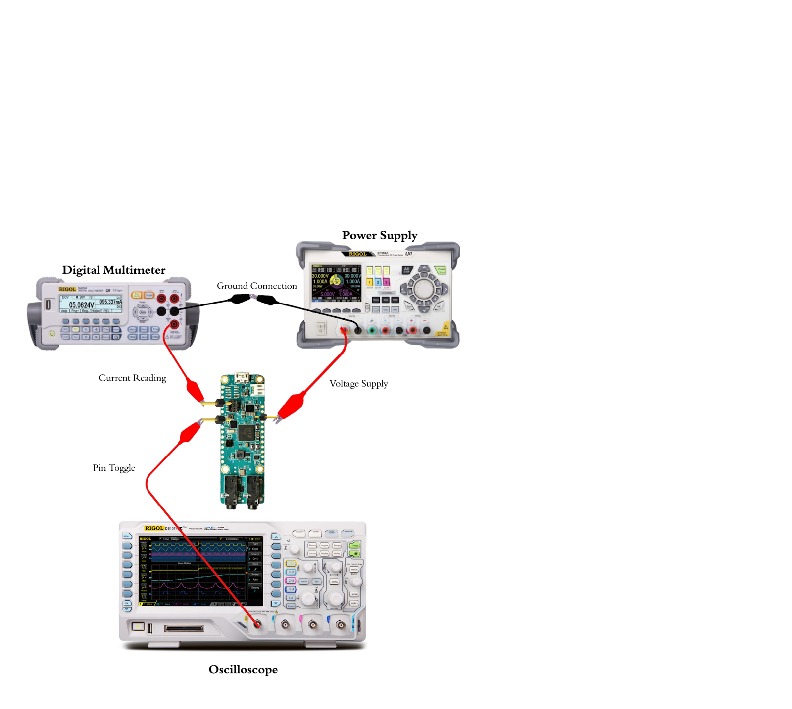

# AI Edge Benchmarking

## Introduction
Welcome to the repository for the AI Edge Benchmarking team!
Our goal is to create a standardized benchmarking process for Edge AI Applications, measuring metrics like inference time, power draw, and energy in order to see how different hardware compares in running AI.

## Current Features
Using the "EdgeImpulse" framework, we are able to have a standardized set of models that can target a variety of boards. These models can be compiled into simple c++ programs that record a precise measurement of inferencing time.

Using the `benchmarking.py` script, we are able to record:
- Current
- Power
- Energy

Raw values are stored in addition to offset values, which come from isolating spikes from idle power consumption. This is more impactful for larger boards such as those in the single board computer class. A pin toggle feature is also used to ensure that power measurements 

## Current State
### List of Current Boards
- Raspberry Pi Pico
- Raspberry Pi Zero
- MAX78000FTHR
### List of In-Progress/Future Boards
- BeagleBone AI-64

## Current Issues

## Procedures
### Measuring Inference Time: Using EdgeImpulse

### Measuring Power and Energy: Using `benchmarking.py`
The `benchmarking.py` script provides a standardized process for measuring inferencing power draw and energy consumption. It can be used with any board that has an external power source option and a GPIO pin that can be toggled on and off.
The procedure for using this script is described below:
1. Set up the hardware as shown in the image below. The power supply positive terminal is connected to the board Vin. The multimeter positive terminal is connected to board GND. The oscilloscope positive terminal is connected to the board pin toggle. All of the negative terminals are connected together. 

2. Set the power supply to provide the 
3. Run the script and provide all information when prompted (such as measuring device IP addresses and operating voltage). 