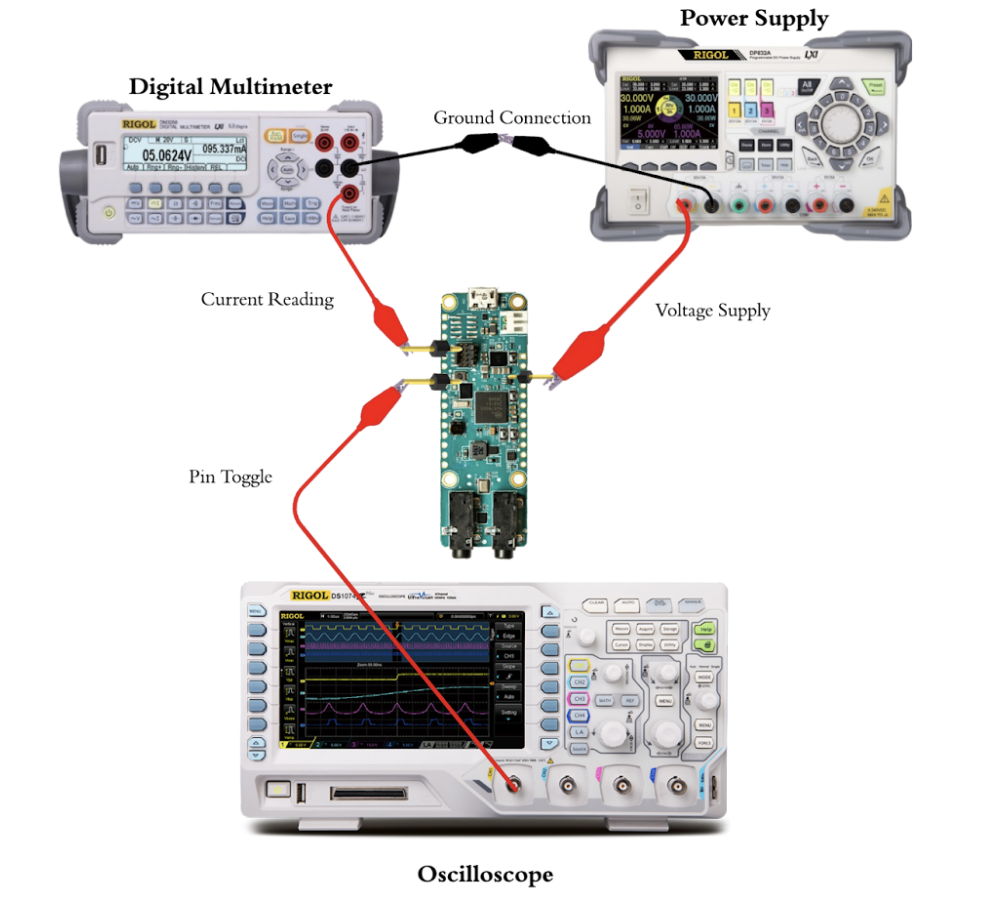

# AI Edge Benchmarking

## Introduction
Welcome to the repository for the AI Edge Benchmarking team!

Our goal is to create a standardized benchmarking process for Edge AI Applications, measuring metrics like inference time, power draw, and energy in order to see how different hardware compares in running AI.

## Current Features
Using the "EdgeImpulse" framework, we are able to have a standardized set of models that can target a variety of boards. These models can be compiled into simple c++ programs that record a precise measurement of inferencing time.

<html>
  

    Using the  
  <a href="./Scripts"><code>/Scripts</code></a> folder, we are able to record:  
  <ul>
    <li>Current</li>
    <li>Power</li>
    <li>Energy</li>
  </ul>

</html>

Inside the scripts folder there is a config file, two measurement scripts, and a comparison script. The user will fill out the config file and set up the measurement equiptment as shown in a diagram below. Using the standardized output file from the measurement script, they are able to directly compare boards in terms of inference time, power, and energy.

<html>
    <h2> Current State </h2>
    <h4>
        <a href = "https://youtu.be/uJIqOznYBQY">
            Video Demonstration of Latest Milestone
        </a>
    </h4>
    <h3> List of Current Boards </h3>
    <ul>
        <li><a href = "/MAX78000_FTHR">MAX78000FTHR</a></li>
        <li><a href = "/RaspberryPi_Pico">Raspberry Pi Pico</a></li>
        <li><a href = "/RaspberryPi_3B">Raspberry Pi 3B</a></li>
        <li>BeagleBone AI-64</li>
        <li>Raspberry Pi 400</li>
    </ul>
</html>

## Current Issues
- Due to multimeter polling rate and network latency, it is not recommended to use the "sampled_power" script for models with an inference time of 100ms or below. Smaller models can be repeated many times in succession to fix this problem and provide more precise measurements. For precise measurements, it is recommended to use the "precise_power" script.

## Procedures
### Measuring Inference Time: Using EdgeImpulse
With Edge Impulse models, measuring inference time is a fully standardized process. Before and after invoking the model, a timer is captured. The elapsed time is stored and transported using serial communication or viewed in a terminal in the case of single-board computers.  

### Measuring Power and Energy: Using files within <a href="./Scripts"><code>/Scripts</code></a>
The <a href="./Scripts"><code>/Scripts</code></a> folder provides three scripts used in the process of measuring power and energy. This process can be done with any board that has an external power source option and a GPIO pin that can be toggled on and off.
The procedure for using these scripts is described below:
1. Fill out the "config.xlsx" file in the scripts folder. This information will tell the measurement scripts how to function. Pay careful attention to the descriptions of each field and the data type they support.
2. Decide on which of the two measurement scripts to use. For models with long inference times (>100ms), sampled_power should be used in order to take multiple recordings during the inferencing process. For models with short inference times (<100 ms), precise_power should be used to guarantee measurements are taken while inferencing.
3. Set up the hardware as shown in the image below. The power supply positive terminal is connected to the board Vin. The multimeter positive terminal is connected to board GND. All of the negative terminals are connected together. For use with sampled_power, the oscilloscope positive terminal is connected to the board pin toggle. (IMPORTANT) For use with precise_power, instead connect the pin toggle directly into the multimeter "External Trigger" port. The oscilloscope is not used with the precise_power script.

4. Set the power supply to provide the correct voltage to your board. This voltage should remain constant during testing.
5. Run the script and press enter when prompted at specific times. 
6. Once the script has finished running, an output csv file (called out.csv) will be created at the chosen file path. This file contains the finalized information for the test.
7. In order to compare the results of 1 or more trials, go to the "analysis_filepaths.txt" file and place the filepath of all outputs to be compared.
8. Running the "analysis.py" script will output a comparison table to the console and create bar graphs in the "/Results" folder.
